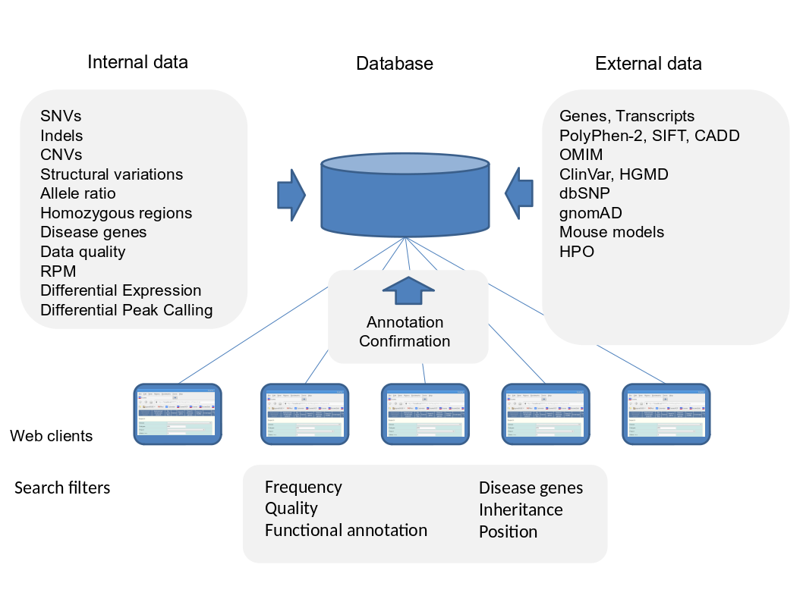

# EVAdb

Clinical Decision Support System and LIMS for NGS Applications

<a href="doc/DatabaseStructure1.png">Database Structure 1</a> 
<a href="doc/DatabaseStructure2.png">Database Structure 2</a> 
<a href="doc/readme_database_installation.txt">Database Installation</a> 
<a href="doc/readme_web_application.txt">Web Application Installation</a> 
<a href="doc/readme_import_external_data.txt">Import of External Data</a> 
<a href="doc/readme_samplesheets.txt">Samplesheets</a> 
 

 
 

Developer and Maintainer: Riccardo Berutti (riccardo.berutti@tum.de / berutti@berutti.net)
Created and developed by Tim M. Strom 
